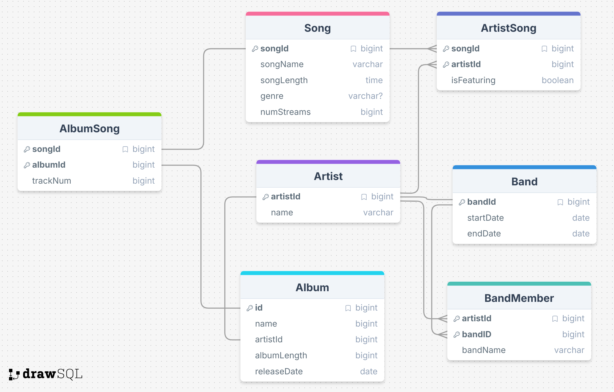

# SAMPLE QUERIES

## Query that went well

*Question:* "What different genres of songs are there?"

*Chat's SQL:* SELECT DISTINCT genre FROM Song;

*Chat's Friendly Response:* This data is a list of different music genres, including styles like alternative hip hop, indie electronic, electronic hip hop, synth-pop, art pop, indie rock, britpop, alternative rock, post-britpop, folk rock, post-punk, hip hop, neo-soul, jazz-funk, electropop, and psychedelic rock.

## Query that went badly

*Question:* "Which artists do not feature on any other artist's songs?"

*Chat's SQL:* SELECT artistName
              FROM Artist
              WHERE artistId NOT IN (SELECT artistId FROM ArtistSong WHERE isFeatured = 1);

*Chat's Response:* Based on your query for artists who do not feature on any other artist's songs, no such artists were found in the database."

I think the query here actually was fine, but either the formatting or the way I executed it caused issues. I found that queries with multiple selects were less successful than single-select queries.